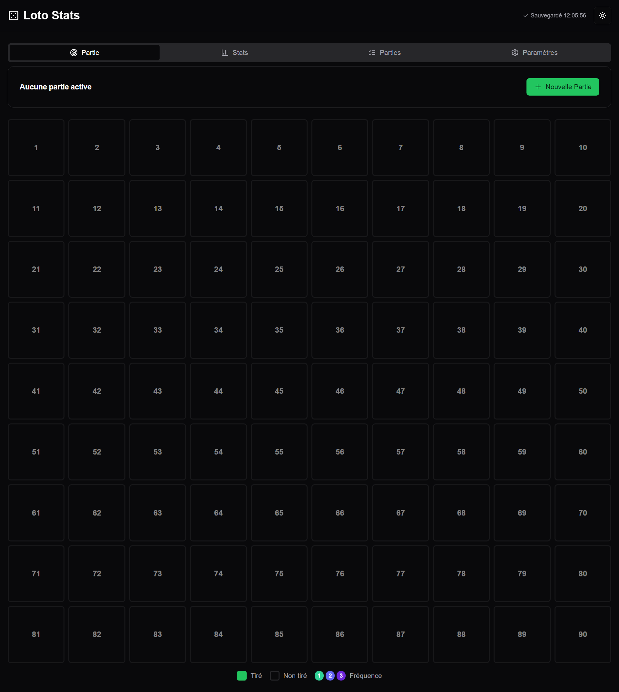
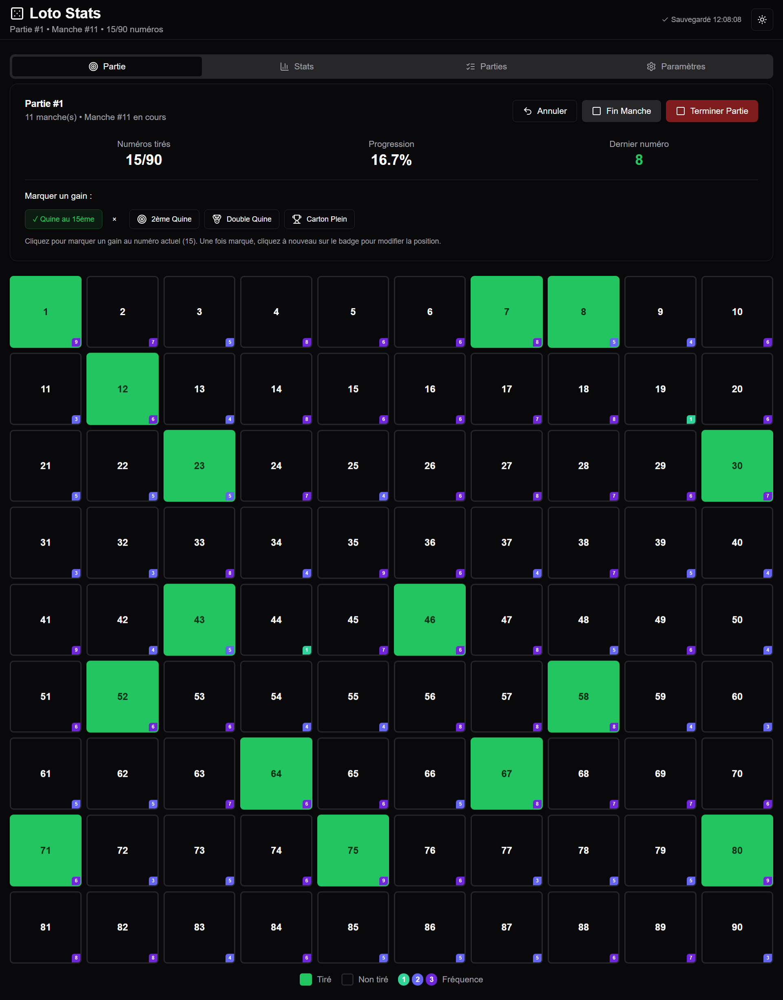
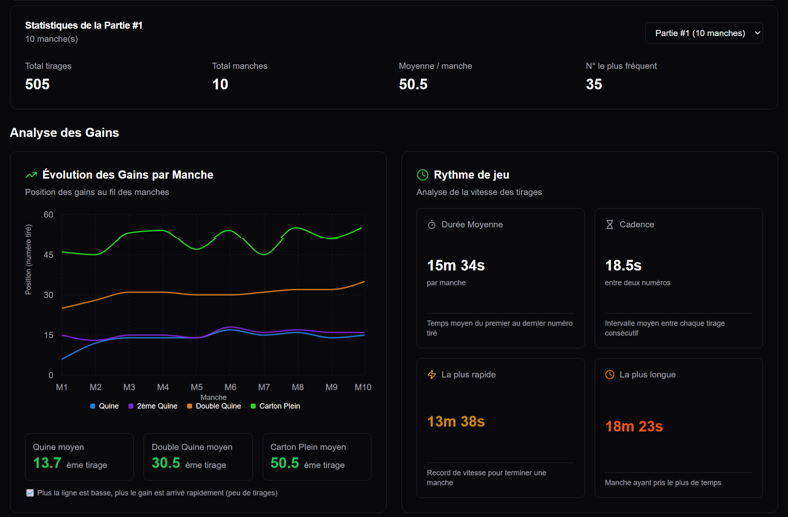
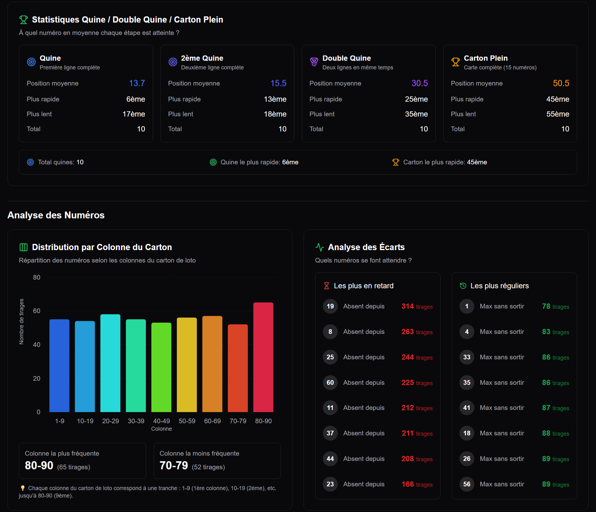
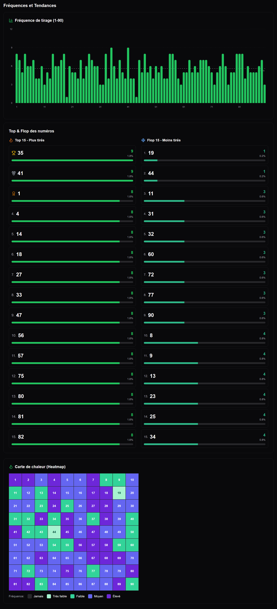
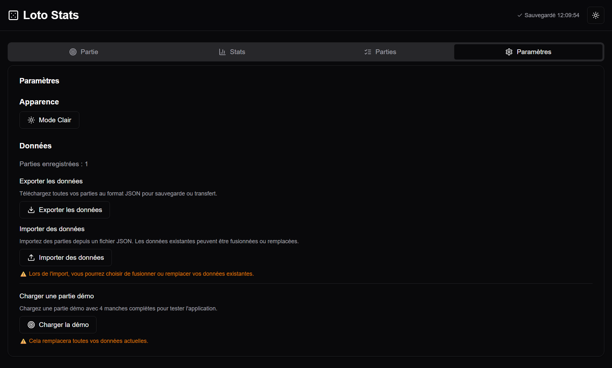

# 🎲 Loto Stats

Application web moderne pour suivre et analyser vos parties de loto en temps réel avec des statistiques détaillées.


<!-- Capture d'écran : Vue globale de l'application avec le header et l'onglet "Partie" -->

## 📋 Table des matières

- [À propos](#à-propos)
- [Fonctionnalités](#fonctionnalités)
- [Démo](#démo)
- [Installation](#installation)
- [Utilisation](#utilisation)
- [Technologies](#technologies)
- [Structure du projet](#structure-du-projet)

## 🎯 À propos

**Loto Stats** est une application web interactive permettant de gérer vos parties de loto de manière professionnelle. Elle offre un suivi en temps réel des numéros tirés, l'enregistrement des gains (Quine, Double Quine, Carton Plein) et génère des statistiques avancées pour analyser vos parties.

L'application stocke toutes vos données localement dans votre navigateur et permet l'export/import au format JSON pour sauvegarder ou partager vos parties.

### Cas d'usage

- **Organisateurs de loto** : Suivez précisément chaque manche et consultez les statistiques après l'événement
- **Passionnés de statistiques** : Analysez les tendances, fréquences et patterns des numéros tirés
- **Clubs et associations** : Gardez un historique de toutes vos parties de loto

## ✨ Fonctionnalités

### 🎮 Gestion de partie en temps réel

- Création et gestion de parties avec plusieurs manches
- Grille interactive de 90 numéros
- Marquage des gains (Quine, 2ème Quine, Double Quine, Carton Plein)
- Modification et suppression des gains
- Fonction "Annuler" pour corriger les erreurs
- Progression en temps réel (numéros tirés, pourcentage)


<!-- Capture d'écran : Onglet "Partie" avec la grille de numéros et les boutons de gains -->

### 📊 Statistiques avancées

#### Analyse des gains
- **Timeline des gains** : Visualisation chronologique des quines par manche
- **Statistiques de timing** : Moyennes et médianes des positions de gains
- **Répartition des gains** : Nombre total de chaque type de gain


<!-- Capture d'écran : Section "Analyse des Gains" avec les graphiques de timeline et timing -->

#### Analyse des numéros
- **Distribution par colonnes** : Fréquence des numéros par dizaines
- **Analyse des écarts** : Numéros les plus et moins fréquents
- **Heatmap** : Visualisation thermique de la fréquence de tous les numéros
- **Top/Flop** : Classement des numéros les plus et moins tirés


<!-- Capture d'écran : Section "Analyse des Numéros" avec les graphiques de distribution -->

#### Fréquences et tendances
- **Graphique de fréquence** : Histogramme des apparitions par numéro
- **Numéros en retard** : Identification des numéros peu tirés


<!-- Capture d'écran : Section "Fréquences et Tendances" avec le bar chart -->

### 📚 Gestion des parties

- Liste complète de toutes vos parties
- Visualisation des manches et des gains associés
- Reprise d'une partie précédente
- Suppression de parties
- Sélection d'une partie pour visualiser ses statistiques


<!-- Capture d'écran : Onglet "Parties" avec la liste des parties enregistrées -->

### ⚙️ Paramètres et données

- **Mode sombre/clair** : Interface adaptable à vos préférences
- **Export JSON** : Sauvegardez toutes vos données
- **Import JSON** : Restaurez ou fusionnez vos données
- **Partie démo** : Testez l'application avec des données pré-remplies
- **Sauvegarde automatique** : Toutes les 5 secondes dans le localStorage


<!-- Capture d'écran : Onglet "Paramètres" avec les options d'export/import -->

### 📱 Interface responsive

- Design adaptatif pour mobile, tablette et desktop
- Navigation par onglets intuitive
- Animations fluides (Framer Motion)
- Interface moderne avec shadcn/ui

## 🚀 Démo

Une partie démo est disponible directement dans l'application via l'onglet "Paramètres" > "Charger la démo".

## 🛠️ Installation

### Prérequis

- Node.js (version 18 ou supérieure)
- npm ou yarn

### Étapes

1. Clonez le dépôt :
```bash
git clone https://github.com/votre-username/loto-stats.git
cd loto-stats
```

2. Installez les dépendances :
```bash
npm install
```

3. Lancez le serveur de développement :
```bash
npm run dev
```

## 💡 Utilisation

### Créer une nouvelle partie

1. Cliquez sur "Nouvelle Partie" dans l'onglet "Partie"
2. Entrez le nom de votre partie
3. Cliquez sur "Nouvelle Manche" pour commencer

### Jouer une manche

1. Cliquez sur les numéros tirés dans la grille
2. Marquez les gains en cliquant sur les boutons correspondants (Quine, Double Quine, etc.)
3. Utilisez "Annuler" pour retirer le dernier numéro tiré
4. Cliquez sur "Fin Manche" pour terminer

### Consulter les statistiques

1. Allez dans l'onglet "Stats"
2. Sélectionnez la partie à analyser dans le menu déroulant
3. Explorez les différentes sections d'analyse

### Sauvegarder vos données

1. Allez dans "Paramètres"
2. Cliquez sur "Exporter les données" pour télécharger un fichier JSON
3. Conservez ce fichier comme sauvegarde

## 🔧 Technologies

- **React 18** - Framework UI
- **TypeScript** - Typage statique
- **Vite** - Build tool moderne
- **Tailwind CSS** - Framework CSS utility-first
- **shadcn/ui** - Composants UI accessibles
- **Radix UI** - Primitives UI headless
- **Recharts** - Bibliothèque de graphiques
- **Framer Motion** - Animations fluides
- **Lucide React** - Icônes
- **date-fns** - Manipulation de dates
- **UUID** - Génération d'identifiants uniques

## 📂 Structure du projet

```
loto-stats/
├── src/
│   ├── components/
│   │   ├── game/          # Composants de jeu (grille, timer, etc.)
│   │   ├── layout/        # Composants de layout (header, tabs, etc.)
│   │   ├── parties/       # Composants de gestion des parties
│   │   ├── stats/         # Composants de statistiques et graphiques
│   │   └── ui/            # Composants UI réutilisables (shadcn/ui)
│   ├── hooks/             # Hooks React personnalisés
│   ├── types/             # Types TypeScript
│   ├── utils/             # Fonctions utilitaires
│   ├── constants/         # Constantes et configuration
│   ├── data/              # Données de démo
│   ├── App.tsx            # Composant principal
│   └── main.tsx           # Point d'entrée
├── public/                # Assets statiques
└── package.json
```

## 👨‍💻 Auteur

Projet créé en une soirée avec **Claude Code** pour tester sa puissance avant d'aller à un loto 🎲

Si vous cherchez un exemple de ce qu'on peut construire rapidement avec l'IA comme assistant de développement, ce projet est une bonne démonstration !

---

**Note** : Cette application stocke toutes les données localement dans votre navigateur. Pensez à exporter régulièrement vos données pour éviter toute perte en cas de suppression du cache du navigateur.
